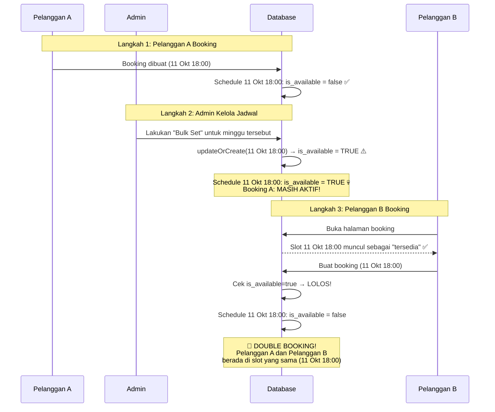

# 🔍 Analisis Bug Double-Booking — v3 (Final)

## Kronologi Kejadian (Flow Baru)

| Langkah | Pelaku | Aksi | Hasil pada DB |
|---|---|---|---|
| 1 | **Si A** | Booking pada 11 Oktober 18:00 | Slot 11 Okt 18:00 menjadi `is_available = false` |
| 2 | **Admin** | Melakukan "Bulk Set" pada minggu tersebut | Slot 11 Okt 18:00 **ditimpa** menjadi `is_available = true` |
| 3 | **Si B** | Booking pada 11 Oktober 18:00 | Berhasil booking karena slot terlihat tersedia! |

**Hasil:** Pada 11 Oktober jam 18:00 → **Si A dan Si B** mengalami double-booking. 🐛

---

## Root Cause: Admin Schedule Management Menimpa Slot yang Sudah Di-Booking

### 🔑 Temuan Kunci: `updateOrCreate` dengan `is_available = true` Menghancurkan Lock Booking

Bug terletak di `ScheduleController`. Ada **3 method** yang bisa me-reset `is_available` ke `true` secara membabi buta, tanpa memeriksa apakah slot tersebut sudah memiliki booking aktif:

#### 1. `store()` — Tambah Slot Individual (Line 65-72)
```php
Schedule::updateOrCreate(
    [
        'barber_id' => $data['barber_id'],
        'date'      => $data['date'],
        'slot_time' => $data['slot_time'],
    ],
    ['is_available' => true],  // ❌ SELALU true, tidak cek booking!
);
```

#### 2. `bulkStore()` — Atur Jadwal Sekaligus (Line 135-142)
```php
Schedule::updateOrCreate(
    [
        'barber_id' => $data['barber_id'],
        'date'      => $scheduleDate,
        'slot_time' => $slotTime,
    ],
    ['is_available' => $data['is_available']]  // ❌ Dari hidden input, SELALU 1
);
```

Dan di view `schedules/index.blade.php` Line 331:
```html
<input type="hidden" name="is_available" value="1">  <!-- SELALU TRUE! -->
```

#### 3. `copyPreviousWeek()` — Copy Jadwal Minggu Lalu (Line 163-170)
```php
Schedule::updateOrCreate(
    [
        'barber_id' => $schedule->barber_id,
        'date'      => CarbonImmutable::parse($schedule->date)->addWeek()->toDateString(),
        'slot_time' => $schedule->slot_time->format('H:i'),
    ],
    ['is_available' => true],  // ❌ SELALU true, menimpa slot yang sudah di-booking!
);
```

> **⚠️ CAUTION:** `updateOrCreate` melakukan UPDATE jika record sudah ada. Jadi jika slot 30 Sep 19:50 sudah exist dan `is_available = false` (karena Rio sudah booking), operasi ini akan **menimpa** menjadi `is_available = true`!

---

### Rekonstruksi Bug yang Sebenarnya Terjadi



---

## Penjelasan Detail

### Langkah 1: Pelanggan A Booking (11 Okt 18:00)
- Booking Si A berhasil dibuat.
- Schedule 11 Okt 18:00 di-set menjadi `is_available = false`.
- **Sistem berjalan normal sampai titik ini.**

### Langkah 2: Admin Melakukan Bulk Set
Admin mengatur jadwal untuk minggu tersebut menggunakan fitur **Bulk Set**. 
Fitur ini memanggil `updateOrCreate` untuk setiap slot jam di hari-hari yang dipilih.

Karena fungsi ini menerima input tersembunyi `is_available = 1` dari form, ia **menimpa paksa (UPDATE)** slot 11 Okt 18:00 yang tadinya `false` kembali menjadi `true`.

> **Pada titik ini:** Booking Si A masih ada, **TAPI** slot schedule-nya mendadak terbuka kembali (`is_available = true`).

### Langkah 3: Pelanggan B Booking (11 Okt 18:00)
Si B membuka halaman booking. Karena slot 11 Okt 18:00 di database bernilai `is_available = true`, slot tersebut ditampilkan kepada Si B.

Si B memilih jadwal tersebut, melanjutkan checkout, dan berhasil! Sistem tidak melakukan cross-check apakah sudah ada pesanan aktif (milik Si A) pada slot tersebut.

**Hasil akhir: Double booking pada 11 Oktober jam 18:00.**

---

## Mengapa Bug Ini Sulit Terdeteksi?

1. **Admin tidak tahu** bahwa "Copy previous week" / "Bulk set" bisa menimpa slot yang sudah di-booking
2. **Tidak ada warning** di UI admin saat slot yang di-overwrite sudah punya booking aktif
3. **`updateOrCreate` bekerja silent** — tidak ada error, tidak ada log
4. **`requestReschedule` dan `paymentDetail` hanya cek `is_available`** — tidak cross-check ke tabel bookings

---

## Semua Kelemahan yang Ditemukan

| No | Kelemahan | File | Line | Severity |
|---|---|---|---|---|
| 1 | **`store()` updateOrCreate selalu set `is_available=true`** — menimpa slot yang sudah di-booking | ScheduleController.php | 65-72 | 🔴 Critical |
| 2 | **`bulkStore()` updateOrCreate dengan hidden `is_available=1`** — menimpa slot yang sudah di-booking | ScheduleController.php | 135-142 | 🔴 Critical |
| 3 | **`copyPreviousWeek()` updateOrCreate selalu set `is_available=true`** — menimpa slot yang sudah di-booking | ScheduleController.php | 163-170 | 🔴 Critical |
| 4 | **Approve reschedule tanpa re-validasi** — tidak cek apakah ada booking aktif di slot tujuan | BookingAdminController.php | 548-574 | 🟡 High |
| 5 | **`requestReschedule()` hanya cek `is_available`** — tidak cross-check ke tabel bookings | BookingController.php | 489-493 | 🟡 High |
| 6 | **Admin drag-drop reschedule hanya cek `is_available`** | ScheduleController.php | 207 | 🟡 High |
| 7 | **Webhook DOKU tidak re-lock schedule** saat payment sukses (defense-in-depth) | DokuWebhookController.php | 141-150 | 🟡 High |
| 8 | **`paymentDetail()` tampilkan slot tanpa cross-check bookings** | BookingController.php | 318-324 | 🟡 Medium |

---

## Proposed Changes (Fix)

### Fix 1 (ROOT CAUSE): Proteksi `updateOrCreate` di ScheduleController

#### [MODIFY] ScheduleController.php — `store()`

```diff
- Schedule::updateOrCreate(
-     [
-         'barber_id' => $data['barber_id'],
-         'date'      => $data['date'],
-         'slot_time' => $data['slot_time'],
-     ],
-     ['is_available' => true],
- );
+ $existing = Schedule::where('barber_id', $data['barber_id'])
+     ->where('date', $data['date'])
+     ->where('slot_time', $data['slot_time'])
+     ->first();
+
+ if ($existing) {
+     // Jangan override slot yang sudah punya booking aktif
+     $hasActiveBooking = Booking::where('schedule_id', $existing->id)
+         ->whereNotIn('status', ['cancelled'])
+         ->exists();
+
+     if ($hasActiveBooking) {
+         return back()->with('error', 'Slot ini sudah memiliki booking aktif dan tidak dapat diubah.');
+     }
+
+     $existing->update(['is_available' => true]);
+ } else {
+     Schedule::create([
+         'barber_id'    => $data['barber_id'],
+         'date'         => $data['date'],
+         'slot_time'    => $data['slot_time'],
+         'is_available' => true,
+     ]);
+ }
```

#### [MODIFY] ScheduleController.php — `bulkStore()`

```diff
  foreach ($data['slot_times'] as $slotTime) {
-     Schedule::updateOrCreate(
-         [
-             'barber_id' => $data['barber_id'],
-             'date'      => $scheduleDate,
-             'slot_time' => $slotTime,
-         ],
-         ['is_available' => $data['is_available']]
-     );
+     $existing = Schedule::where('barber_id', $data['barber_id'])
+         ->where('date', $scheduleDate)
+         ->where('slot_time', $slotTime)
+         ->first();
+
+     if ($existing) {
+         // Skip jika slot sudah punya booking aktif
+         $hasActiveBooking = Booking::where('schedule_id', $existing->id)
+             ->whereNotIn('status', ['cancelled'])
+             ->exists();
+
+         if (!$hasActiveBooking) {
+             $existing->update(['is_available' => $data['is_available']]);
+         }
+     } else {
+         Schedule::create([
+             'barber_id'    => $data['barber_id'],
+             'date'         => $scheduleDate,
+             'slot_time'    => $slotTime,
+             'is_available' => $data['is_available'],
+         ]);
+     }
  }
```

#### [MODIFY] ScheduleController.php — `copyPreviousWeek()`

```diff
  ->each(function (Schedule $schedule) use ($targetStart): void {
-     Schedule::updateOrCreate(
-         [
-             'barber_id' => $schedule->barber_id,
-             'date'      => CarbonImmutable::parse($schedule->date)->addWeek()->toDateString(),
-             'slot_time' => $schedule->slot_time->format('H:i'),
-         ],
-         ['is_available' => true],
-     );
+     $targetDate = CarbonImmutable::parse($schedule->date)->addWeek()->toDateString();
+
+     $existing = Schedule::where('barber_id', $schedule->barber_id)
+         ->where('date', $targetDate)
+         ->where('slot_time', $schedule->slot_time->format('H:i'))
+         ->first();
+
+     if ($existing) {
+         // Skip jika slot sudah punya booking aktif
+         $hasActiveBooking = Booking::where('schedule_id', $existing->id)
+             ->whereNotIn('status', ['cancelled'])
+             ->exists();
+
+         if (!$hasActiveBooking) {
+             $existing->update(['is_available' => true]);
+         }
+     } else {
+         Schedule::create([
+             'barber_id'    => $schedule->barber_id,
+             'date'         => $targetDate,
+             'slot_time'    => $schedule->slot_time->format('H:i'),
+             'is_available' => true,
+         ]);
+     }
  });
```

---

### Fix 2: Cross-check booking di `requestReschedule()` (Defense-in-depth)

#### [MODIFY] BookingController.php — `requestReschedule()`

```diff
  $newSchedule = Schedule::whereKey($data['schedule_id'])
      ->where('barber_id', $booking->barber_id)
      ->where('is_available', true)
      ->upcoming()
+     ->lockForUpdate()
      ->first();

  if (! $newSchedule) {
      return $this->rescheduleFailed($reference, 'Slot jadwal yang dipilih sudah tidak tersedia.');
  }

+ // Cross-check: pastikan tidak ada booking aktif lain di slot ini
+ $conflictExists = Booking::where('schedule_id', $newSchedule->id)
+     ->where('id', '!=', $booking->id)
+     ->whereNotIn('status', ['cancelled'])
+     ->exists();
+
+ if ($conflictExists) {
+     return $this->rescheduleFailed($reference, 'Slot jadwal yang dipilih sudah dipesan pelanggan lain.');
+ }
```

---

### Fix 3: Validasi ulang saat approve reschedule

#### [MODIFY] BookingAdminController.php — `updateStatus()`

```diff
  } elseif ($booking->status === 'reschedule_requested' && $data['status'] === 'confirmed') {
      if ($booking->requested_schedule_id) {
-         $newSchedule = Schedule::find($booking->requested_schedule_id);
+         $newSchedule = Schedule::lockForUpdate()->find($booking->requested_schedule_id);
          if ($newSchedule) {
+             // Validasi: pastikan tidak ada booking aktif lain di slot ini
+             $conflictingBooking = Booking::where('schedule_id', $newSchedule->id)
+                 ->where('id', '!=', $booking->id)
+                 ->whereNotIn('status', ['cancelled'])
+                 ->exists();
+
+             if ($conflictingBooking) {
+                 Schedule::whereKey($booking->requested_schedule_id)
+                     ->update(['is_available' => true]);
+                 $booking->update([
+                     'status' => 'confirmed',
+                     'requested_schedule_id' => null,
+                 ]);
+                 throw ValidationException::withMessages([
+                     'status' => 'Slot jadwal baru sudah terisi oleh booking lain. Reschedule gagal.',
+                 ]);
+             }
+
              // 1. Bebaskan slot jadwal lama
              ...
```

---

### Fix 4: Cross-check di admin drag-drop reschedule

#### [MODIFY] ScheduleController.php — `rescheduleBooking()`

```diff
  if ($targetSchedule && ! $targetSchedule->is_available && $targetSchedule->id !== $booking->schedule_id) {
      return back()->with('error', '...');
  }

+ // Cross-check: pastikan tidak ada booking aktif lain di slot target
+ if ($targetSchedule && $targetSchedule->id !== $booking->schedule_id) {
+     $conflictExists = Booking::where('schedule_id', $targetSchedule->id)
+         ->where('id', '!=', $booking->id)
+         ->whereNotIn('status', ['cancelled'])
+         ->exists();
+
+     if ($conflictExists) {
+         return back()->with('error', 'Slot ini sudah memiliki booking aktif dari pelanggan lain.');
+     }
+ }
```

---

### Fix 5: Webhook DOKU re-lock schedule (Defense-in-depth)

#### [MODIFY] DokuWebhookController.php

```diff
  if ($isPaid) {
      $booking->update([
          'outstanding_amount' => $outstanding,
          'status'             => 'confirmed',
      ]);
+
+     // Re-lock slot jadwal untuk konsistensi data
+     if ($booking->schedule && $booking->schedule->is_available) {
+         $booking->schedule->update(['is_available' => false]);
+     }
  }
```

---

### Fix 6: Filter slot di `paymentDetail()` view (Defense-in-depth)

#### [MODIFY] BookingController.php — `paymentDetail()`

```diff
  $availableSchedules = Schedule::with('barber')
      ->whereIn('barber_id', $barberIds)
      ->where('is_available', true)
      ->upcoming()
+     ->whereDoesntHave('bookings', function ($query) {
+         $query->whereNotIn('status', ['cancelled']);
+     })
      ->orderBy('date')
      ->orderBy('slot_time')
      ->get();
```

---

## Verification Plan

### Automated Tests
```bash
php artisan test --filter=Booking
```

### Manual Verification
1. **Test "Copy previous week"** saat minggu target sudah ada booking aktif — slot yang di-booking harus TIDAK berubah ke available
2. **Test "Bulk set"** jadwal saat slot sudah punya booking — slot harus di-skip
3. **Test "+ slot"** individual pada slot yang sudah di-booking — harus ditolak
4. **Test reschedule ke slot "ghost"** (is_available=true tapi ada booking) — harus ditolak
5. **Test normal flow** — booking, cancel, reschedule ke slot kosong tetap berjalan normal
6. **Data repair:** Jalankan query untuk menemukan inkonsistensi yang sudah ada:
   ```sql
   SELECT s.id, s.barber_id, s.date, s.slot_time, s.is_available, b.id as booking_id, b.name, b.status
   FROM schedules s
   JOIN bookings b ON b.schedule_id = s.id
   WHERE s.is_available = 1
   AND b.status NOT IN ('cancelled')
   ORDER BY s.date, s.slot_time;
   ```
