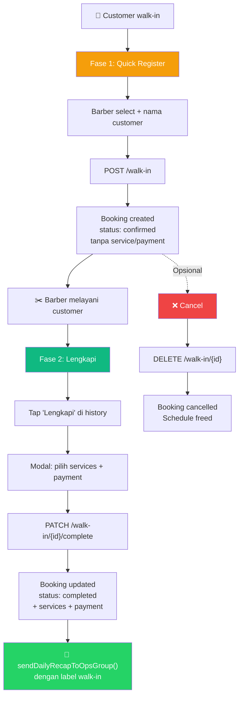

# Walk-in Page — Implementation Plan (Final)

## Goal

Membuat halaman web walk-in (`kref.test/walk-in`) dengan 2-fase flow:

1. **Fase 1 — Quick Register**: Pilih barber → ketik nama → save → `confirmed` (tanpa service)
2. **Fase 2 — Complete**: Setelah selesai melayani → tap "Lengkapi" → pilih services + payment → save → `completed` → notif WA dengan label walk-in

### Keputusan yang Sudah Fix

| Keputusan | Detail |
|-----------|--------|
| Notifikasi WA | **Hanya Fase 2** (saat complete), via `sendDailyRecapToOpsGroup()` dengan label `(walk-in)` |
| Webhook WAHA lama | **Dihapus / Dinonaktifkan** (sudah di-disable di WAHA) |
| Cancel walk-in | **Bisa** dari history list |
| Autentikasi | **Tidak ada** (public URL) |
| Identifikasi barber | **Select dropdown** di form |
| PIN | **Tidak ada** |

### Motivasi label walk-in di rekap WA

Rekap WA adalah patokan komisi barber. Dengan label `(walk-in)`, entry walk-in bisa dibedakan dari booking online:

```
Senin, 29 September 2026

Rizal:
09:00: andi FP 40k
10:00: budi FP 70k (walk-in)     ← label walk-in
11:00:
13:00: rudi DP 40k (walk-in)     ← label walk-in
14:00: agus FP 70k

Sogi:
10:00: citra FP 70k
11:00: dedi FP 250k (walk-in)    ← label walk-in
```

---

## Flow Diagram



---

## UI Mockup

### Halaman Utama

```
┌──────────────────────────────────┐
│  ✂️ KREF Walk-in                │
│                                  │
│  ┌─ DAFTARKAN WALK-IN ────────┐ │
│  │                             │ │
│  │  Barber: [▼ Pilih Barber ]  │ │
│  │                             │ │
│  │  Nama:   [______________]   │ │
│  │                             │ │
│  │  [     ➕ Daftarkan      ]  │ │
│  └─────────────────────────────┘ │
│                                  │
│  ── Walk-in Hari Ini (3) ──────  │
│                                  │
│  ┌─────────────────────────────┐ │
│  │ 🟡 10:30 — Budi            │ │
│  │ Barber: Rizal               │ │
│  │ ⏳ Menunggu dilengkapi      │ │
│  │ [🔧 Lengkapi] [❌ Cancel]  │ │
│  └─────────────────────────────┘ │
│                                  │
│  ┌─────────────────────────────┐ │
│  │ ✅ 09:00 — Andi            │ │
│  │ Barber: Sogi                │ │
│  │ Regular Haircut — Rp 70.000 │ │
│  │ 💳 Cash • Lunas            │ │
│  └─────────────────────────────┘ │
│                                  │
│  ┌─────────────────────────────┐ │
│  │ 🟡 11:00 — Rudi            │ │
│  │ Barber: Rizal               │ │
│  │ ⏳ Menunggu dilengkapi      │ │
│  │ [🔧 Lengkapi] [❌ Cancel]  │ │
│  └─────────────────────────────┘ │
└──────────────────────────────────┘
```

### Modal "Lengkapi"

```
┌──────────────────────────────────┐
│  🔧 Lengkapi: Budi              │
│  Barber: Rizal • 10:30          │
│                                  │
│  ✂️ Pilih Service:              │
│  ┌─ Haircut ──────────────────┐ │
│  │ ┌──────────┐┌────────────┐ │ │
│  │ │✅Haircut ││ Long Trim  │ │ │
│  │ │  70K     ││   80K      │ │ │
│  │ └──────────┘└────────────┘ │ │
│  └────────────────────────────┘ │
│  ┌─ Chemicals ────────────────┐ │
│  │ ┌──────────┐┌────────────┐ │ │
│  │ │ Perming  ││Design Perm │ │ │
│  │ │  250K    ││   300K     │ │ │
│  │ └──────────┘└────────────┘ │ │
│  └────────────────────────────┘ │
│  ... (scrollable)                │
│                                  │
│  💰 Total: Rp 70.000            │
│                                  │
│  💳 Pembayaran:                 │
│  [● Lunas] [○ DP]              │
│  [● Cash ] [○ QRIS]            │
│                                  │
│  ┌──────────────────────────┐   │
│  │    ✅ Simpan & Selesai   │   │
│  └──────────────────────────┘   │
│  [          Batal           ]   │
└──────────────────────────────────┘
```

---

## Proposed Changes

### Overview

| File | Action | Deskripsi |
|------|--------|-----------|
| `app/Http/Controllers/WalkInPageController.php` | **NEW** | Controller: index, store, complete, cancel |
| `resources/views/walkin/page.blade.php` | **NEW** | Halaman walk-in (form + history + modal) |
| `routes/web.php` | **MODIFY** | Tambah 4 route walk-in |
| `app/Services/BookingNotificationService.php` | **MODIFY** | Tambah label `(walk-in)` di rekap |
| `routes/api.php` | **MODIFY** | Hapus route webhook `/api/waha/webhook` lama |
| `app/Http/Controllers/Api/WahaWebhookController.php` | **DELETE** | Hapus controller webhook WAHA lama |
| `app/Services/WalkInService.php` | **DELETE** | Hapus service parser pesan WhatsApp lama |

> **Tidak ada migration baru** — menggunakan model dan tabel yang sudah ada.

---

### 1. Routes

#### [MODIFY] `routes/web.php`

Tambah di dalam grup domain utama, sebelum `});` penutup:

```php
use App\Http\Controllers\WalkInPageController;

// Walk-in Page (barber-facing, no auth)
Route::get('/walk-in', [WalkInPageController::class, 'index'])->name('walkin.index');
Route::post('/walk-in', [WalkInPageController::class, 'store'])->name('walkin.store');
Route::patch('/walk-in/{booking}/complete', [WalkInPageController::class, 'complete'])->name('walkin.complete');
Route::delete('/walk-in/{booking}', [WalkInPageController::class, 'cancel'])->name('walkin.cancel');
```

---

### 2. Controller

#### [NEW] `app/Http/Controllers/WalkInPageController.php`

**3 actions utama:**

**`index()`** — Tampilkan halaman:
- Query barber aktif untuk dropdown
- Query walk-in hari ini (`source = 'walk_in'`, `scheduled_at = today`) untuk history list
- Query services aktif untuk modal "Lengkapi"

**`store(Request $request)`** — Fase 1, Quick Register:
- Validasi: `barber_id` (required, exists) + `name` (required, string, max:255)
- **Schedule slot assignment logic:**
  1. Cari slot **available** terdekat yang akan datang untuk barber ini hari ini
  2. Jika ada dan **≤ 30 menit** dari sekarang → kunci slot tersebut
  3. Jika tidak ada, atau slot terdekat **> 30 menit** → buat slot baru di waktu sekarang
- Buat Booking: `source='walk_in'`, `status='confirmed'`, `total_amount=0`, tanpa service/payment
- Redirect back dengan success flash

**Contoh schedule assignment:**
```
Sekarang: 10:15, slot 10:30 available → ≤30min → kunci 10:30
Sekarang: 10:01, slot terdekat 11:00  → >30min → buat slot 10:01
Sekarang: 14:00, tidak ada slot       →         → buat slot 14:00
```

**`complete(Request $request, Booking $booking)`** — Fase 2, Lengkapi:
- Validasi: `service_ids` (required, array), `payment_type` (full/dp), `payment_method` (cash/qris_static)
- Buat BookingItems dari services yang dipilih (termasuk owner price markup)
- Buat Payment record
- Update Booking: `status='completed'`, `total_amount`, `outstanding_amount`, `payment_id`, `payment_type`
- Panggil `$notifications->sendDailyRecapToOpsGroup($date)`
- Redirect back dengan success flash

**`cancel(Booking $booking)`** — Cancel walk-in:
- Pastikan booking = walk_in dan belum completed
- Update `status='cancelled'`
- Bebaskan schedule slot (`is_available = true`)
- Redirect back dengan success flash

```php
<?php

namespace App\Http\Controllers;

use App\Models\Barber;
use App\Models\Booking;
use App\Models\Payment;
use App\Models\Schedule;
use App\Models\Service;
use App\Services\BookingNotificationService;
use Carbon\Carbon;
use Illuminate\Http\Request;
use Illuminate\Support\Facades\DB;
use Illuminate\Validation\ValidationException;

class WalkInPageController extends Controller
{
    public function index()
    {
        $barbers = Barber::where('is_active', true)
            ->orderBy('name')->get(['id', 'name', 'role']);

        $today = Carbon::today()->toDateString();

        $walkIns = Booking::with(['barber:id,name,role', 'items.service:id,name', 'payment'])
            ->where('source', 'walk_in')
            ->whereDate('scheduled_at', $today)
            ->orderByDesc('scheduled_at')
            ->get();

        $services = Service::where('is_active', true)
            ->orderBy('category')->orderBy('name')
            ->get(['id', 'name', 'code', 'price', 'category']);

        $serviceCategories = $services
            ->groupBy(fn ($s) => $s->category ?: 'Other')
            ->map(fn ($items, $cat) => [
                'name'     => $cat,
                'services' => $items,
            ])->values();

        return view('walkin.page', [
            'barbers'           => $barbers,
            'walkIns'           => $walkIns,
            'serviceCategories' => $serviceCategories,
            'today'             => $today,
        ]);
    }

    public function store(Request $request)
    {
        $data = $request->validate([
            'barber_id' => ['required', 'exists:barbers,id'],
            'name'      => ['required', 'string', 'max:255'],
        ]);

        $barber = Barber::where('id', $data['barber_id'])
            ->where('is_active', true)->firstOrFail();

        $today = Carbon::today()->toDateString();
        $now   = now();
        $currentTime = $now->format('H:i:00');
        $maxUpcomingTime = $now->copy()->addMinutes(30)->format('H:i:59');

        DB::transaction(function () use ($data, $barber, $today, $now, $currentTime, $maxUpcomingTime) {
            // 1. Cari slot available yang akan datang dalam rentang <= 30 menit
            $schedule = Schedule::where('barber_id', $barber->id)
                ->where('date', $today)
                ->where('is_available', true)
                ->whereBetween('slot_time', [$currentTime, $maxUpcomingTime])
                ->orderBy('slot_time')
                ->first();

            // 2. Jika tidak ada slot available <= 30 menit (slot terdekat > 30 menit atau belum ada),
            // assign ke jam saat itu juga
            if (!$schedule) {
                $schedule = Schedule::where('barber_id', $barber->id)
                    ->where('date', $today)
                    ->where('slot_time', $currentTime)
                    ->first();

                if (!$schedule) {
                    $schedule = Schedule::create([
                        'barber_id'    => $barber->id,
                        'date'         => $today,
                        'slot_time'    => $currentTime,
                        'is_available' => true,
                    ]);
                } elseif (!$schedule->is_available) {
                    // Fallback jika jam saat ini persis sedang terisi
                    for ($m = 1; $m <= 10; $m++) {
                        $altTime = $now->copy()->addMinutes($m)->format('H:i:00');
                        $alt = Schedule::firstOrCreate(
                            ['barber_id' => $barber->id, 'date' => $today, 'slot_time' => $altTime],
                            ['is_available' => true]
                        );
                        if ($alt->is_available) {
                            $schedule = $alt;
                            break;
                        }
                    }
                }
            }

            $slotTimeStr = $schedule->slot_time instanceof \DateTimeInterface
                ? $schedule->slot_time->format('H:i:s')
                : $schedule->slot_time;

            Booking::create([
                'schedule_id'        => $schedule->id,
                'barber_id'          => $barber->id,
                'name'               => $data['name'],
                'phone'              => null,
                'source'             => 'walk_in',
                'status'             => 'confirmed',
                'payment_type'       => null,
                'total_amount'       => 0,
                'outstanding_amount' => 0,
                'scheduled_at'       => $today . ' ' . $slotTimeStr,
            ]);

            $schedule->update(['is_available' => false]);
        });

        return redirect()->route('walkin.index')
            ->with('success', "Walk-in {$data['name']} berhasil didaftarkan.");
    }

    public function complete(
        Request $request,
        Booking $booking,
        BookingNotificationService $notifications
    ) {
        abort_if($booking->source !== 'walk_in', 404);
        abort_if($booking->status === 'completed', 422, 'Sudah dilengkapi.');

        $data = $request->validate([
            'service_ids'    => ['required', 'array', 'min:1'],
            'service_ids.*'  => ['integer', 'distinct', 'exists:services,id'],
            'payment_type'   => ['required', 'in:full,dp'],
            'payment_method' => ['required', 'in:cash,qris_static'],
        ], [
            'service_ids.required' => 'Wajib memilih minimal 1 layanan.',
        ]);

        DB::transaction(function () use ($data, $booking) {
            $booking->load('barber');
            $barber = $booking->barber;

            $services = Service::whereIn('id', $data['service_ids'])
                ->where('is_active', true)->get();
            abort_if($services->count() !== count($data['service_ids']), 422);

            // Owner price markup (konsisten dengan BookingAdminController)
            $serviceItems = $services->map(function ($svc) use ($barber) {
                $isOwnerRegular = strtolower($barber->role) === 'owner'
                    && str_contains(strtolower($svc->name), 'regular haircut');
                return [
                    'service' => $svc,
                    'name'    => $isOwnerRegular
                        ? preg_replace('/^regular\s+/i', '', $svc->name)
                          . ' - By ' . $barber->name
                        : $svc->name,
                    'price'   => $svc->price + ($isOwnerRegular ? 10000 : 0),
                ];
            });

            $total       = (int) $serviceItems->sum('price');
            $dpAmount    = (int) config('booking.dp_amount', 40000);
            $paid        = $data['payment_type'] === 'dp' ? $dpAmount : $total;
            $outstanding = max(0, $total - $paid);

            $booking->items()->createMany(
                $serviceItems->map(fn ($item) => [
                    'item_type'             => 'service',
                    'service_id'            => $item['service']->id,
                    'qty'                   => 1,
                    'service_name_snapshot' => $item['name'],
                    'price_snapshot'        => $item['price'],
                ])->all()
            );

            $payment = Payment::create([
                'amount'      => $paid,
                'method'      => $data['payment_method'],
                'provider'    => 'manual',
                'purpose'     => $data['payment_type'] === 'dp' ? 'dp' : 'walk_in',
                'status'      => 'paid',
                'recorded_by' => null,
            ]);

            $booking->update([
                'payment_id'         => $payment->id,
                'payment_type'       => $data['payment_type'],
                'total_amount'       => $total,
                'outstanding_amount' => $outstanding,
                'status'             => 'completed',
            ]);
        });

        // Kirim rekap harian ke grup WA ops (dengan label walk-in)
        $notifications->sendDailyRecapToOpsGroup(
            Carbon::parse($booking->scheduled_at)->toDateString()
        );

        return redirect()->route('walkin.index')
            ->with('success', "Walk-in {$booking->name} berhasil dilengkapi.");
    }

    public function cancel(Booking $booking)
    {
        abort_if($booking->source !== 'walk_in', 404);
        abort_if(
            in_array($booking->status, ['completed', 'cancelled']),
            422,
            'Booking tidak dapat dibatalkan.'
        );

        DB::transaction(function () use ($booking) {
            $booking->update(['status' => 'cancelled']);

            if ($booking->schedule) {
                $booking->schedule->update(['is_available' => true]);
            }
        });

        return redirect()->route('walkin.index')
            ->with('success', "Walk-in {$booking->name} dibatalkan.");
    }
}
```

---

### 3. View

#### [NEW] `resources/views/walkin/page.blade.php`

Layout standalone (tanpa sidebar admin), mobile-first, Blade + Alpine.js + Tailwind/DaisyUI.

**Struktur komponen:**

| Section | Deskripsi |
|---------|-----------|
| Header | Logo + judul "KREF Walk-in" |
| Quick Register | Select barber + input nama + tombol daftarkan |
| History List | Card per walk-in hari ini, sorted terbaru di atas |
| Modal Lengkapi | Service grid + payment selection + live total + tombol simpan |
| Flash Messages | Success/error alerts setelah aksi |

**Alpine.js state:**
```js
x-data="{
    // Modal
    showModal: false,
    activeBooking: null,

    // Service selection
    selectedServices: [],
    
    // Payment
    paymentType: 'full',
    paymentMethod: 'cash',

    // Computed
    get total() {
        return this.selectedServices.reduce((sum, s) => sum + s.price, 0);
    },

    openComplete(booking) {
        this.activeBooking = booking;
        this.selectedServices = [];
        this.paymentType = 'full';
        this.paymentMethod = 'cash';
        this.showModal = true;
    },

    toggleService(service) {
        const idx = this.selectedServices.findIndex(s => s.id === service.id);
        idx >= 0 ? this.selectedServices.splice(idx, 1) : this.selectedServices.push(service);
    },

    isSelected(id) {
        return this.selectedServices.some(s => s.id === id);
    }
}"
```

**Desain:**
- Brand style Kref: cream `#FAF8F5`, red `#C83E3E`
- Font: Montserrat + League Gothic
- Mobile-optimized: `max-w-lg mx-auto` centered layout
- Service cards: 2 kolom grid, tap to toggle, visual feedback (`border-brand bg-brand/10`)
- History cards: badge 🟡 (pending) / ✅ (complete) / ❌ (cancelled)

---

### 4. Label Walk-in di Rekap WhatsApp

#### [MODIFY] `app/Services/BookingNotificationService.php`

Di method [`sendDailyRecapToOpsGroup()`](file:///C:/laragon/www/kref/app/Services/BookingNotificationService.php#L271-L385), **Line 365**, tambahkan label `(walk-in)` jika booking berasal dari walk-in:

**Sebelum (Line 365):**
```php
$lines[] = "{$time}: {$name} {$paymentType} {$amountFormatted}";
```

**Sesudah:**
```php
$sourceLabel = $booking->source === 'walk_in' ? ' (walk-in)' : '';
$lines[] = "{$time}: {$name} {$paymentType} {$amountFormatted}{$sourceLabel}";
```

**Hasil di WhatsApp:**
```
Rizal:
09:00: andi FP 40k
10:00: budi FP 70k (walk-in)
11:00:
13:00: rudi DP 40k (walk-in)
14:00: agus FP 70k
```

> [!NOTE]
> Walk-in yang belum di-complete (Fase 1 saja, tanpa service/payment) **tidak akan masuk ke dalam rekap WA sama sekali**. Data tersebut hanya akan tersimpan dan tampil di history (halaman Walk-in) sampai barber melengkapinya.

---

### 5. Pembersihan Sistem Lama

Karena webhook di WAHA sudah dinonaktifkan, komponen webhook walk-in lama akan dibersihkan:

| File | Tindakan |
|------|----------|
| `routes/api.php` | Hapus route `POST /waha/webhook` dan import `WahaWebhookController` |
| `app/Http/Controllers/Api/WahaWebhookController.php` | Hapus file |
| `app/Services/WalkInService.php` | Hapus file |

---

## Verification Plan

### Automated Tests

```bash
php artisan test --filter=WalkInPage
```

| Test | Assertion |
|------|-----------|
| `test_index_shows_form_and_history` | 200 OK, barber dropdown + walk-in list visible |
| `test_store_creates_confirmed_booking` | Booking created: source=walk_in, status=confirmed, total=0 |
| `test_store_auto_creates_schedule` | Schedule record created for current time |
| `test_store_handles_slot_conflict` | Slot occupied → auto-shift to next minute |
| `test_complete_adds_services_and_payment` | BookingItems + Payment created, status=completed |
| `test_complete_applies_owner_markup` | Rizal + Regular Haircut → +10K |
| `test_complete_calculates_dp_correctly` | DP → paid=dpAmount, outstanding=total-dpAmount |
| `test_cancel_frees_schedule` | Status=cancelled, schedule.is_available=true |
| `test_cancel_rejects_completed` | 422 if already completed |
| `test_recap_includes_walkin_label` | Rekap WA contains "(walk-in)" for walk-in bookings |

### Manual Verification

1. Buka `kref.test/walk-in` di HP
2. **Fase 1**: Pilih barber → ketik nama → tap Daftarkan → muncul di history (badge kuning)
3. **Fase 2**: Tap "Lengkapi" → modal → pilih services → pilih payment → simpan → badge hijau
4. **Cancel**: Tap ❌ Cancel pada walk-in yang belum di-complete → hilang/badge merah
5. **Admin panel**: Cek walk-in muncul di booking list
6. **WhatsApp**: Cek rekap menampilkan label `(walk-in)` di entry yang benar
7. **Multiple walk-in**: Daftarkan 3+ walk-in berturut-turut → slot time auto-increment
